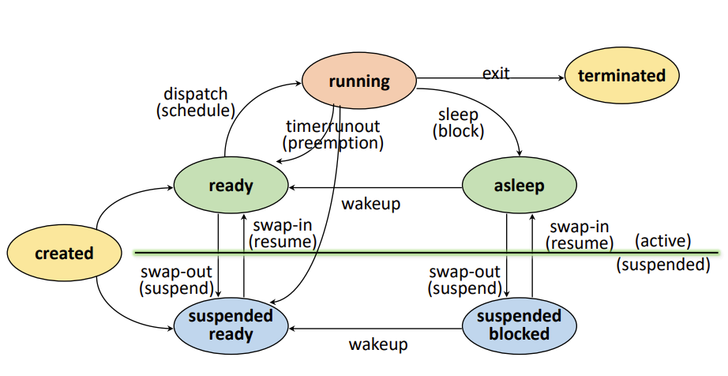

Q1) 운영체제란?

컴퓨터 자원을 효율적으로 관리하기 위한 시스템

Q2) Process State Transition 과정에 대해 아래 그림을 보며 설명하시오.

A1) created stae에서 작업(job)을 커널에 등록하고 PCB 할당 및 프로세스를 생성함

할당할 메모리가 있으면 ready state로 넘어가고 dispatch과정을 통해 running 단계로 넘어가 실행함

running state에서 timerunout등의 이유로 프로세서를 뺏길 땐 ready state로 넘어가고 I/O등의 자원 할당을 요청할 땐 asleep state로 넘어감

asleep state에서는 다시 바로 running state로 넘어가는 것이 아니라 ready state를 거쳐 running state로 넘어가게 됨

suspended state는 메모리를 할당 받지 못한 경우로 현재 진행 정보를 swap device에 보관하고 이를 swap-out이라 함, 반대로 복구할 때는 swap-in이라 함

모든 프로세스 수행이 끝난 후에는 terminated state로 넘어가고 모든 자원은 반납하고 커널 내에 일부 PCB 정보만 남아있는 상태가 됨