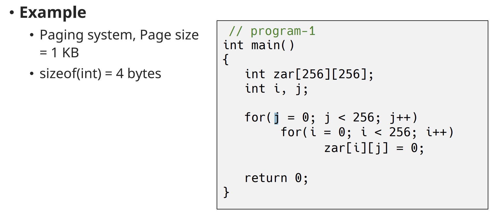
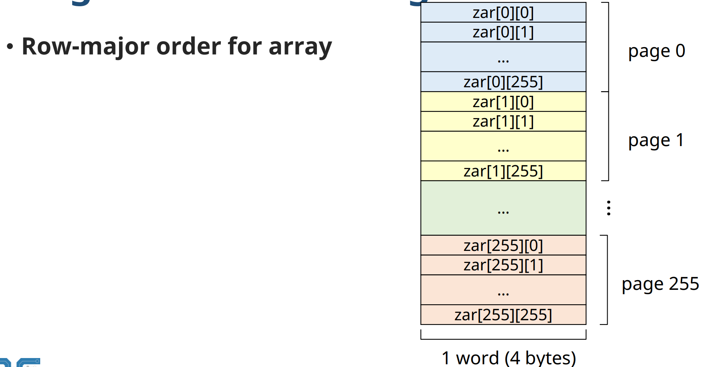
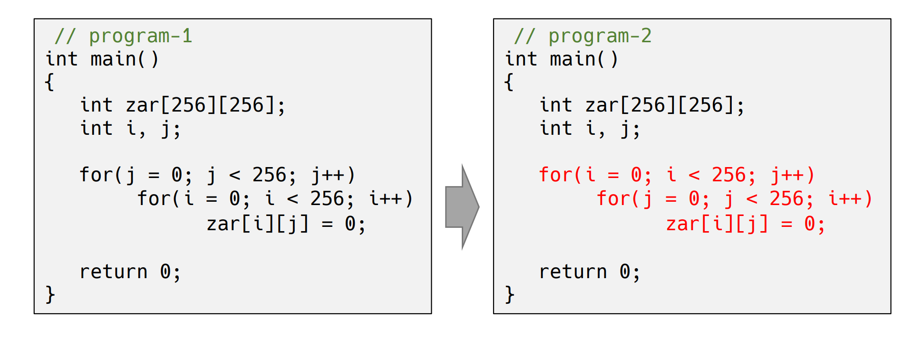

# Virtual Memory Management: Other considerations

## Page Size

✔ **시스템 특성에 따라 다르다**

- 정답 x
- 점점 커지는 경향

✔ 일반적인 page size

- 2^7(128) bytes ~ 2^22(4M) bytes

### Small page size vs Large page size

| Small Page Size            | Large Page Size            |
| -------------------------- | -------------------------- |
| Large page table / # of PF  | Small page table / # of PF |
| high overhead(kernel)           | low overhead(kernel)           |
| 내부 단편화 감소           | 내부 단편화 증가           |
| I/O시간 증가               | I/O시간 감소               |
| locality 향상              | locality 저하              |
| page fault 증가            | page fault 감소            |

✔ HW 발전 경향
- CPU ↑, Memory size ↑ -> 상대적인 page fault 처리 비용 ↑
- CPU 발전 속도와 disk 발전 속도의 gap 증가 -> I/O bottle neck 가능성 ↑ -> I/O 시간 감소 필요

## Program Restructuring

✔ **가상 메모리 시스템의 특성에 맞도록 프로그램을 재구성**

✔ **사용자가 가상 메모리 관리 기법 (paging system)에 대해 이해하고 있다면, 프로그램의 구조를 변경하여 성능을 높일 수 있다**

### Example

✔ zar를 다 0으로 만드는 프로그램

✔ 메모리에는 행단위로 적재 된다.

✔ 탐색 순서를 바꿔서 행이 바뀔 때만 page fault가 발생하도록 변경

## TLB Reach

✔ **TLB(Translation Lookaside Buffer) : 가상 메모리 주소를 물리적인 주소로 변환하는 속도를 높이기 위해 사용되는 캐시**
- 최근에 일어난 가상 메모리 주소와 물리 주소의 변환 테이블을 저장

✔ TLB Reach: TLB를 통해 접근 할 수 있는 메모리의 양
- (# of entries) * (page size)

✔ TLB의 hit ratio
- TLB의 크기 증가
  - expensive
- Page 크기 증가 of 다양한 page size 지원
  - OS의 지원 필요
    - 최근 OS의 발전 경향