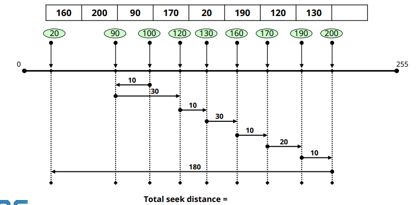
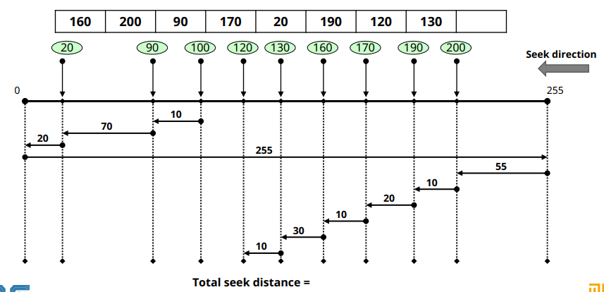
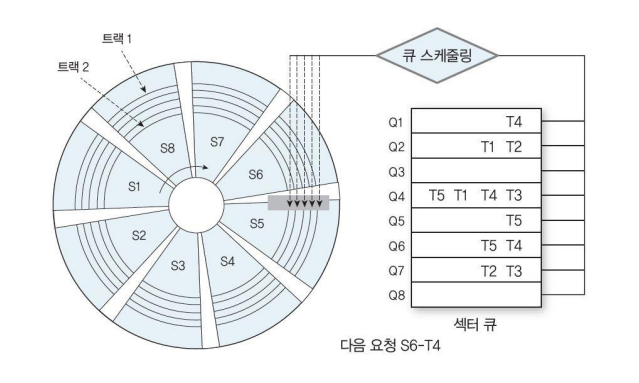

# Disk Scheduling

## Disk Scheduling

✔ **Disk access 요청들의 처리 순서 결정** 

✔ **Disk system의 성능 향상**

✔ 평가 기준
- **Throughput**: 단위 시간당 처리량
- **Mean response time**: 평균 응답 시간
- **Predictability**: 응답 시간의 예측성
  - 요청이 무기한 연기(starvation)되지 않도록 방지  

### Disk Access Time

1. Seek time
   - 디스크 head를 필요한 cylinder로 이동하는 시간
2. Rotational delay
   - (1 이후부터) 필요한 sector가 head위치로 도착하는 식나
3. Data transmission time
   - (2 이후부터) 해당 sector를 읽어서 전송(or 기록)하는 시간

## Optimizing Seek Time

### FCFS (First Come First Service)

✔ **요청이 도착산 순서에 따라 처리**

✔ 장점
- Simple : Low Scheduling overhead
- 공평한 처리 기법 (무한 대기 방지)

✔ 단점
- 최적 성능 달성에 대한 고려 없음

✔ **Disk access 부하가 적은 경우에 적합**

#### Example

✔ 총 256개의 cylinder로 구성  
✔ Head의 시작 위치: 100번 cylinder  
✔ Access request queue  

✔ Total Seek distance = 690

### SSTF (Shortest Seek Time First)

✔ **현재 head 위치에서 가장 가까운 요청 먼저 처리**

✔ 장점
- Throughput ↑
- 평균 응답 시간 ↓

✔ 단점
- Predictability ↓
- Starvation 현상 발생 가능

✔ **일괄 처리 시스템에 적합**
- 처리 시간이 중요하며 순서 중요 x

#### Example

✔ Total Seek Distance = 300

✔ head 위치 20에 대해서 starvation 발생!

### Scan Scheduling

✔ **현재 head의 진행 방향에서, head와 가장 가까운 요청 먼저 처리**

✔ **(진행방향 기준)마지막 cylinder 도착 후, 반대 방향으로 진행**

✔ 장점
- SSTF의 starvation 문제 해결
- Throughput 및 평균 응답시간 우수

✔ 단점
- 진행 방향 반대쪽 끝의 요청들의 응답시간 ↑

#### Example

✔ Total Seek Distance = 300

### C-Scan (Circular Scan) Scheduling

✔ **Scan과 유사**

✔ **Head가 미리 정해진 방향으로만 이동**
- 마지막 cylinder 도착 후, 시작 cylinder로 이동 후 재시작

✔ 장점
- Scan 대비 균등한 기회 제공

### Example

✔ Total Seek Distance = 490

✔ 처음으로 돌아가는 과정에서 추가 이동 발생

### Look Scheduling

✔ **Elevator Algorithm**

✔ **Scan(C-scan)에서 현재 진행 방향에 요청이 없으면 방향 전환**
- 마지막 cylinder까지 이동하지 않음
- Scan (C-Scan)의 실제 구현 방법

✔ 장점
- Scan의 불필요한 이동 제거

#### Example

✔ Total Seek Distance = 260

## Optimizing rotational delay

### SLTF (Shortest Latency Time First)

✔ **Fixed head disk 시스템 사용**
- 각 track마다 head를 가진 disk
  - ex: drum disk
- Head의 이동이 없음

✔ **Sector queuing algorithm**
- 각 sector 별 queue 유지
- Head 아래 도착한 sector의 queue에 있는 요청을 먼저 처리

✔ Moving Head disk의 경우 같은 **cylinder 또는 track에 여러 개의 요청 처리를 위해 사용 가능**
- Head가 특정 Cylinder에 도착하면 고정 후 해당 cylinder의 요청 모두 처리

## SPTF (Shortest Positioning TIme First)

✔ **Positioning time = Seek time + Rotational delay**

✔ **Positioning time이 가장 작은 요청 먼저 처리**

✔ 장점
- Througput 증가, 평균 응답 시간 감소

✔ 단점
- 가장 안쪽과 바깥쪽 cylinder의 요청에 대해 starvation 현상 발생 가능

### **Eschenbach Scheduling**

✔ Positioning time 최적화 시도

✔ Disk가 1회전 하는 동안 요청을 처리할 수 있도록 요청을 정렬
- 한 cylinder 내, track, sector들에 대한 다수의 요청이 있는 경우, 다음 회전에 처리